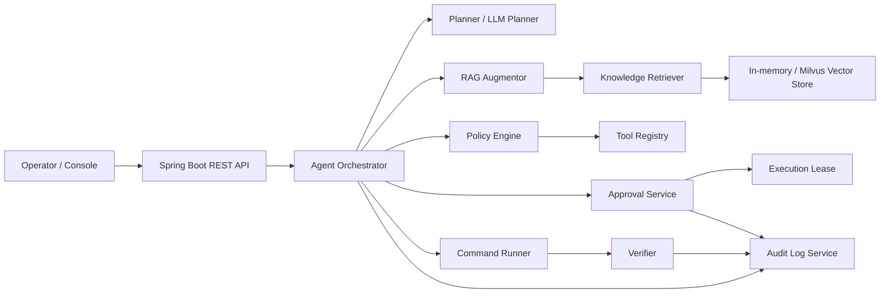
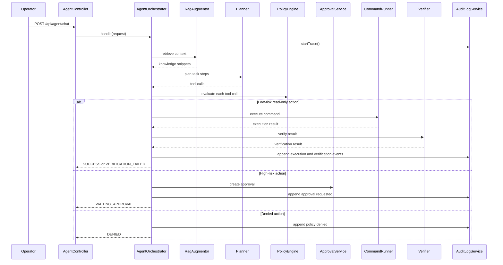
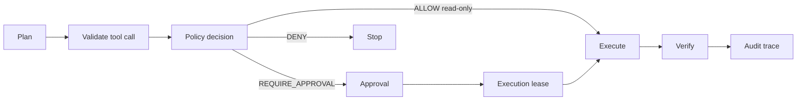
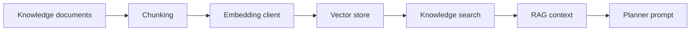
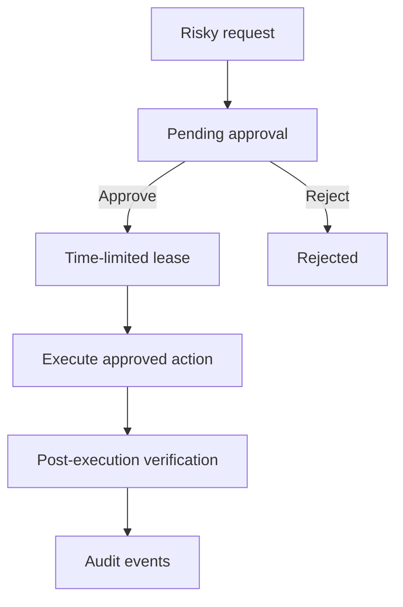
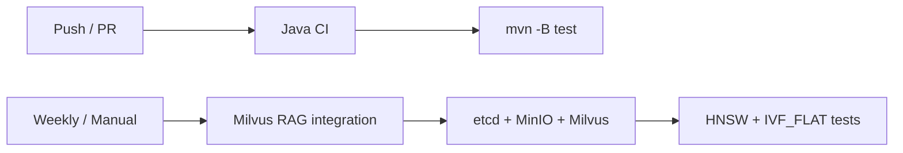

# Architecture

QilingOS SafeOps Agent is organized around one principle:

> AI can propose operational actions, but deterministic safety components decide whether those actions can run.

## High-level modules

## Request lifecycle

## Safety pipeline

## RAG pipeline

Supported vector stores:

- In-memory vector store for local tests and demos.
- Milvus vector store for real vector retrieval.

Supported Milvus index strategies:

- `autoindex`
- `hnsw`
- `ivf-flat`

## Approval execution model

A high-risk action does not execute immediately. The system creates an approval record containing a stable action hash. After approval, a short-lived execution lease is issued. Execution must match the approved tool and arguments.

## Audit model

Audit traces are grouped by `traceId`. Events are appended through `AuditLogService`; integrity checks verify that trace data has not been tampered with.

Important audit moments:

- Trace started.
- Planner produced tool calls.
- Policy allowed, denied, or required approval.
- Approval requested/granted/rejected.
- Execution completed.
- Verification passed/failed.
- RAG ingestion/search related events.

## CI architecture

