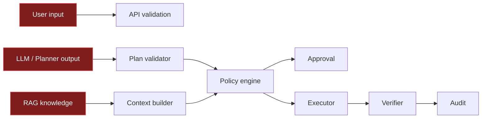

# Security Model

QilingOS SafeOps Agent is designed for safety-first operations automation.

## Core assumptions

1. User input is untrusted.
2. LLM output is untrusted.
3. RAG knowledge is untrusted context, not authorization.
4. Tools must be registered and validated before execution.
5. High-risk actions require explicit approval.
6. Execution results must be verified.
7. Every important decision must be auditable.

## Trust boundaries



## Defense layers

### 1. API validation

Request DTOs use Bean Validation constraints such as `@NotBlank`, `@NotEmpty`, `@Min`, and `@Max`. Invalid input is rejected before reaching business logic.

### 2. Tool registry

Only registered tools can be called. Tool definitions include:

- Name
- Description
- Input schema
- Risk level
- Read-only flag
- Approval requirement
- Permission requirement
- Timeout and output limit

### 3. Policy engine

The policy engine decides whether a tool call is allowed, denied, or requires approval.

Examples:

- Read-only system load check can be allowed.
- Service restart requires approval.
- Shell wrapper execution is denied by command runner safeguards.

### 4. Approval workflow

Approval records include action identity and action hash. Approval creates a time-limited lease. Execution must use the approved lease and matching action.

### 5. Command execution safety

The command runner validates command templates and rejects denied shell wrappers such as:

```text
sh
bash
cmd.exe
powershell.exe
pwsh.exe
```

It also enforces:

- Timeouts
- Output limits
- Failure codes
- Process cleanup

### 6. Verification

Execution is not the final source of truth. Verifiers inspect the execution result and decide whether the operation is actually successful.

For read-only tools, the verifier requires successful execution and non-empty output.

### 7. Audit trace

Every major lifecycle event is recorded under a trace. Integrity checks help detect accidental or malicious trace tampering.

## RAG-specific controls

RAG knowledge is used only as context. It must not bypass:

```text
Plan validation
Policy engine
Approval workflow
Execution verification
Audit trace
```

A malicious knowledge document may suggest a dangerous command, but it cannot directly execute the command because tool calls still pass through deterministic policy controls.

## Secrets policy

Never commit real credentials.

Secret-like values must be provided by environment variables or CI secret management:

```text
SAFEOPS_RAG_MILVUS_TOKEN
SAFEOPS_RAG_EMBEDDING_API_KEY
```

Allowed in repository:

```text
.env.example with empty placeholders
```

Not allowed:

```text
.env
.env.local
.env.*.local
real API keys
tokens
private certificates
```

## CI safety

- Java CI runs default tests without real secrets.
- Milvus integration CI uses temporary local containers.
- The CI Milvus instance is unauthenticated but isolated inside the runner.
- No production secret is required for current workflows.

## Known limitations

- The project currently focuses on backend safety controls and demo-ready operations flows.
- A production deployment should add authentication, authorization, tenant isolation, persistent secret management, and full RBAC UI.
- Approval list/search APIs can be expanded for a production-grade console.

## Security roadmap

- Add explicit OpenAPI security documentation.
- Add dependency review workflow.
- Add role-aware approval listing APIs.
- Add signed release artifacts.
- Add production deployment hardening guide.
